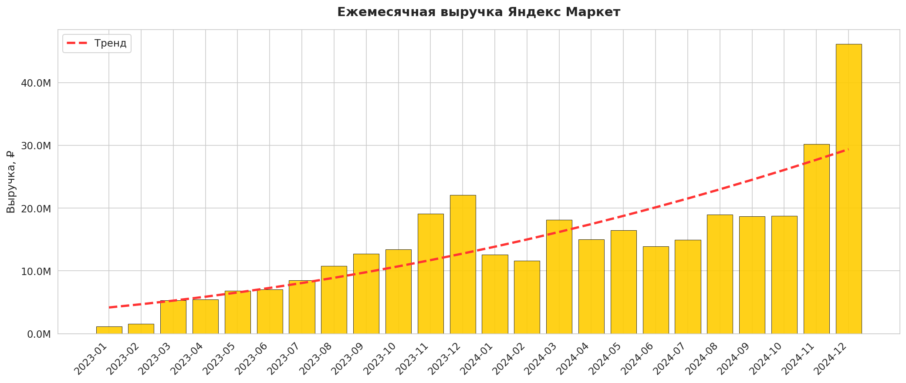
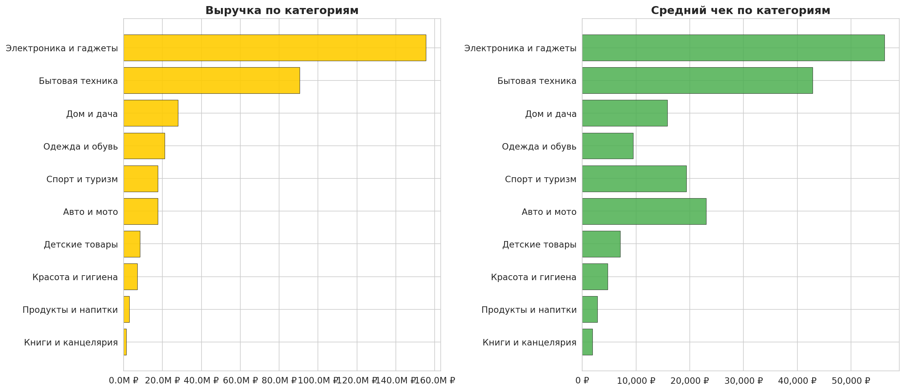
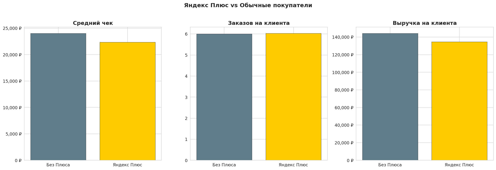
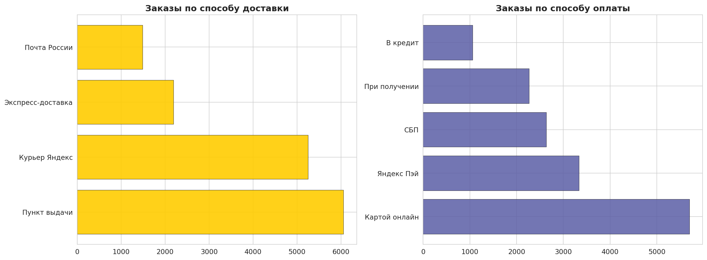
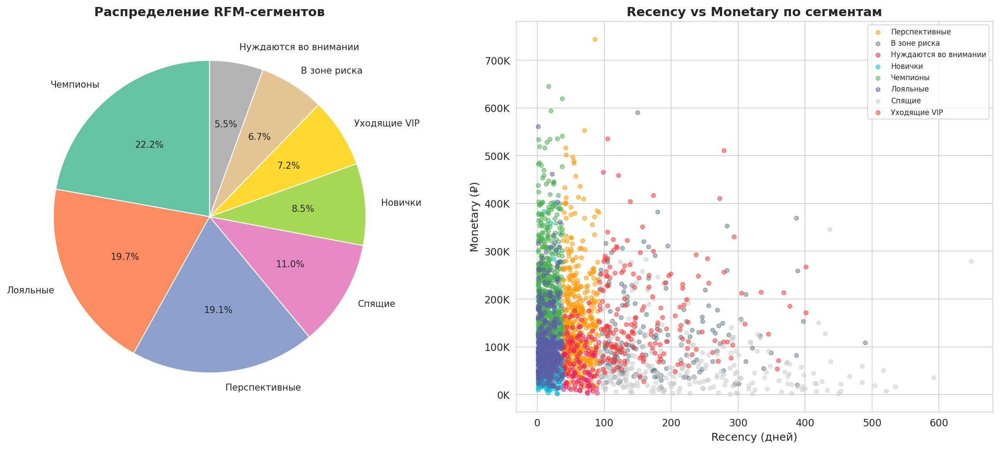
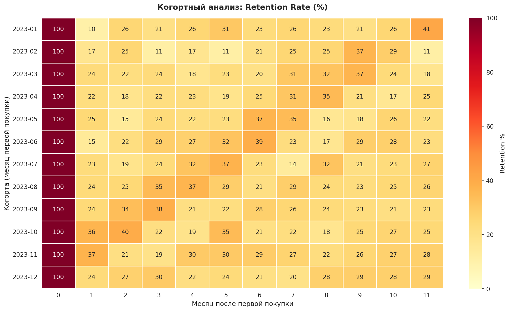
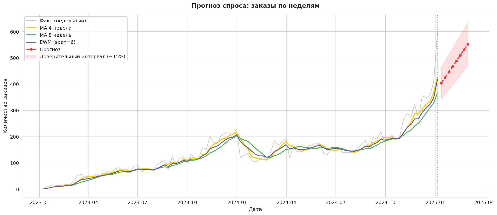
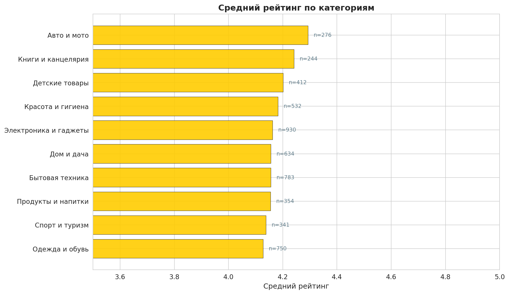

# 📊 Yandex Market Sales Analytics

Аналитика продаж Яндекс Маркета: EDA, анализ подписки Плюс, RFM-сегментация, когортный анализ удержания и прогнозирование спроса.

---

## О проекте

Комплексный анализ данных e-commerce маркетплейса на примере Яндекс Маркета. Используется синтетический датасет из **18 000 заказов** и **2 500 покупателей** за период 2023–2024 гг., имитирующий реальные паттерны: сезонность, подписку Яндекс Плюс, различные способы доставки и оплаты, рейтинги товаров.

**Ключевые задачи:**
- Exploratory Data Analysis и расчёт бизнес-метрик
- Анализ влияния подписки Яндекс Плюс на поведение покупателей
- Анализ способов доставки и оплаты
- RFM-сегментация клиентской базы
- Когортный анализ удержания (Retention)
- Прогноз спроса методами MA и экспоненциального сглаживания
- Визуализация результатов (11 графиков)

---

## Структура проекта

```
yandex-market-analytics/
├── data/
│   ├── customers.csv         
│   ├── orders.csv            
│   └── rfm_segments.csv       
├── src/
│   ├── generate_data.py      
│   └── analysis.py           
├── sql/
│   └── queries.sql            
├── visuals/                
├── requirements.txt
└── README.md
```

---

## Технологии

| Инструмент | Применение |
|:---|:---|
| **Python 3.10+** | Основной язык |
| **Pandas** | Обработка и агрегация данных |
| **NumPy** | Вычисления, прогнозирование |
| **Matplotlib / Seaborn** | Визуализация |
| **SQL** | Аналитические запросы |

---

## Результаты анализа

### EDA: ключевые метрики

| Метрика | Значение |
|:---|---:|
| Всего заказов | 18 000 |
| Уникальных покупателей | 2 496 |
| Подписчиков Яндекс Плюс | 42% |
| Общая выручка | 349.4 млн ₽ |
| Средний чек | 23 312 ₽ |
| Средний рейтинг | 4.17 |
| Доля доставленных | 83.3% |
| Доля возвратов | 9.1% |

### Динамика выручки



Чёткая сезонность: пик в ноябре-декабре (Black Friday, Новый год), заметный рост в марте (8 марта).

### Анализ категорий



### Яндекс Плюс vs Обычные покупатели



Подписчики Плюса получают в среднем скидку **11.9%** против **6.7%** у обычных покупателей. При этом частота покупок сопоставима, что говорит о высокой лояльности подписчиков.

### Способы доставки и оплаты



Пункты выдачи — самый популярный способ получения (40.4%), «Картой онлайн» и «Яндекс Пэй» суммарно покрывают 60% платежей.

### RFM-сегментация

| Сегмент | Покупатели | Ср. заказов | Ср. выручка |
|:---|---:|---:|---:|
| Чемпионы | 553 | 8.4 | 228 423 ₽ |
| Уходящие VIP | 180 | 7.3 | 168 997 ₽ |
| Перспективные | 476 | 6.8 | 156 865 ₽ |
| Лояльные | 492 | 6.0 | 105 283 ₽ |
| Спящие | 275 | 3.0 | 65 384 ₽ |



### Когортный анализ



Retention стабилизируется на уровне 20–35% после 2-го месяца.

### Прогноз спроса



Прогноз на 8 недель с использованием MA (4 и 8 недель) и экспоненциального сглаживания. Доверительный интервал ±15%.

### Рейтинги по категориям



---

## Запуск

```bash
# Клонировать репозиторий
git clone https://github.com/henwrr/yandex-market-analytics.git
cd yandex-market-analytics

# Установить зависимости
pip install -r requirements.txt

# Сгенерировать данные
python src/generate_data.py

# Запустить анализ
python src/analysis.py
```

---
